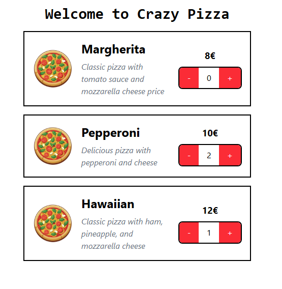

# Crazy Pizza 🍕

Crazy Pizza is an easy-to-use pizza ordering application that lets users select and order pizzas online. The app is built with **React** and focuses on providing a simple and interactive user experience.



## Objetives 🎯
The main objective of this project is to practice and improve my skills with React

- Strengthen my understanding of React components and hooks ✔

- Improve my ability to manage state and props. ✔

- Enhance my knowledge of handling form inputs and events in React. ✔


## Features 📦 

- **Pizza Selection**: Choose from a variety of pizzas and toppings.

##  Todos 📋

- ⬜ Add more pizza options and customizable toppings
- ⬜ Add payment gateway integration (e.g., Stripe)

## How to Run

To run this project locally, follow these steps:

1. Clone this repository to your local machine

```
    git clone https://github.com/thaishdz/crazy-pizza.git
```

2. Navigate to the project directory
```
    cd crazy-pizza
```

3. Install the dependencies
```
    npm install
```

4. Start the development server
```
    npm run dev
```


## Technologies Used 🚀 

- Typescript
- React
- TailwindCSS
- Vite


